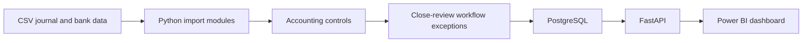

# CloseIQ

CloseIQ is an accounting close and reconciliation MVP that turns journal-entry and bank-transaction data into reviewable accounting exceptions.

It is a portfolio project built around a practical workflow:

```text
Import accounting data → run controls → persist exceptions → review via API and Power BI
```

> This project uses synthetic data only. It is not production accounting software and does not automatically post journal entries.

## What CloseIQ does

* Validates that every journal entry balances.
* Detects duplicate external references across journal entries.
* Reconciles bank transactions against cash-side ledger activity.
* Creates workflow exceptions with severity, status, source IDs, and evidence.
* Persists accounting data and exceptions in PostgreSQL.
* Supports reviewer decisions: `acknowledge`, `resolve`, and `dismiss`.
* Exposes close data through a FastAPI service.
* Includes a Power BI dashboard for close-review metrics and exception details.
* Runs the end-to-end workflow with one command.

## Current controls

| Control                       | Example issue detected                                           |
| ----------------------------- | ---------------------------------------------------------------- |
| Journal balance validation    | Debits and credits do not balance                                |
| Duplicate-reference detection | An ACH or external reference appears in multiple journals        |
| Bank reconciliation           | A bank transaction has no match or multiple cash-ledger matches  |
| Exception workflow            | A reviewer acknowledges, resolves, or dismisses a detected issue |

## Architecture



## Tech stack

| Area                       | Technology          |
| -------------------------- | ------------------- |
| Accounting controls        | Python              |
| Database                   | PostgreSQL 17       |
| Local database environment | Docker Compose      |
| Database driver            | Psycopg             |
| API                        | FastAPI and OpenAPI |
| Analytics                  | Power BI Desktop    |
| Testing                    | Python `unittest`   |
| Version control            | Git and GitHub      |

## Quick start

### 1. Start PostgreSQL

Create a local `.env` file from the safe template:

```powershell
Copy-Item .env.example .env
```

Edit `.env` and set a private local password:

```text
POSTGRES_PASSWORD=your_local_password_here
```

Start the database:

```powershell
docker compose up -d
```

Apply the schema:

```powershell
Get-Content -Raw database/schema.sql | docker compose exec -T db psql -U closeiq_app -d closeiq
```

### 2. Create the Python environment

```powershell
python -m venv .venv
.\.venv\Scripts\python.exe -m pip install "psycopg[binary]" python-dotenv "fastapi[standard]"
```

### 3. Load the chart of accounts

```powershell
$env:PYTHONPATH = "$PWD\src"
.\.venv\Scripts\python.exe -c "from closeiq.seed_accounts import seed_accounts; print(seed_accounts('data/chart_of_accounts.csv'))"
```

### 4. Run the full close workflow

```powershell
$env:PYTHONPATH = "$PWD\src"
.\.venv\Scripts\python.exe -m closeiq.cli run-close data/journal_entries.csv data/bank_transactions.csv
```

The sample data intentionally produces four review exceptions:

* One unbalanced journal entry
* One duplicate external reference
* One ambiguous bank-to-ledger match
* One unmatched bank transaction

## Run tests

```powershell
.\.venv\Scripts\python.exe -m unittest discover -s tests -v
```

## Run the API

```powershell
$env:PYTHONPATH = "$PWD\src"
.\.venv\Scripts\python.exe -m uvicorn closeiq.api:app --reload
```

Then open:

* http://127.0.0.1:8000/docs
* http://127.0.0.1:8000/health
* http://127.0.0.1:8000/exceptions
* http://127.0.0.1:8000/close-summary

## API endpoints

| Method | Endpoint                               | Purpose                                              |
| ------ | -------------------------------------- | ---------------------------------------------------- |
| `GET`  | `/health`                              | Confirms the API is running                          |
| `GET`  | `/exceptions`                          | Returns open close exceptions                        |
| `GET`  | `/close-summary`                       | Returns counts by workflow status                    |
| `POST` | `/exceptions/{exception_id}/decisions` | Records an acknowledge, resolve, or dismiss decision |

Example decision request:

```json
{
  "decision": "acknowledge",
  "note": "Reviewed the supporting accounting evidence."
}
```

## Power BI dashboard

The Power BI report is available at:

```text
powerbi/CloseIQ_Close_Review_Dashboard.pbix
```

It connects to the local FastAPI endpoints and displays:

* Total, open, reviewed, and resolved exception counts
* Open exception details and supporting reasons
* Open exceptions by severity

Keep the FastAPI server running while refreshing the dashboard in Power BI Desktop.

## Repository structure

```text
src/closeiq/       Python application modules
tests/              Automated tests
data/               Synthetic journal, bank, and chart-of-accounts data
database/           PostgreSQL schema
powerbi/            CloseIQ Power BI dashboard
docs/               Roadmap and project documentation
```

## Current scope and next steps

CloseIQ currently demonstrates an end-to-end accounting close-review workflow with synthetic data.

Planned extensions include:

* Period-based close runs and audit history
* API-driven imports
* Role-based reviewer identity
* GitHub Actions continuous integration
* Read-only MCP tools for evidence-grounded accounting analysis
* External integrations such as QuickBooks, Stripe, or bank sandbox APIs

## Design principles

* Accounting controls detect issues; they do not silently change accounting records.
* Exceptions carry IDs, severity, status, source records, and evidence.
* Reviewer actions should be explicit and auditable.
* Future AI tools should be read-only by default and cite the underlying accounting evidence.
